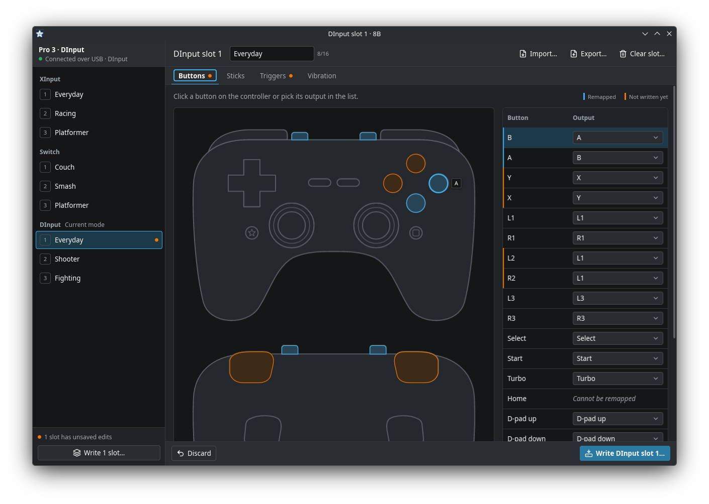

<div align="center">


# 8B

**Read and edit the profiles stored on your 8BitDo controller, over USB, on Linux.**

[Download](#download) · [Supported devices](#supported-devices) · [USB permission](#usb-permission) · [Build from source](#build-from-source) · [Licence](#licence)



</div>

## Supported devices

| Controller | Supported features |
| --- | --- |
| 8BitDo Pro 3 | Edit button mapping, sticks, triggers and vibration in every slot of XInput, Switch and DInput. Clear slots. Import and export profiles as JSON. View macros (read-only). |

To add another controller, see [Adding a controller](docs/adding-a-controller.md).

## Roadmap

- [ ] Macro creation and editing
- [ ] Support for more controllers
- [ ] Internationalization (translated interface)

## Download

Download the latest AppImage from the [releases page](https://github.com/LucasPicoli/8B/releases), run `chmod +x` on it, and start it. x86_64 is tested; the aarch64 build has not been tested on hardware.

## USB permission

Linux blocks apps from opening the controller until a device rule allows it. On first run, 8B asks to install one and prompts for your password once (through `pkexec`). It writes `/etc/udev/rules.d/70-8b.rules`, which gives the logged-in user access to 8BitDo controllers, then reloads udev. If you prefer, the window shows the same steps as one command to run yourself.

To remove it:

```sh
sudo rm /etc/udev/rules.d/70-8b.rules
sudo udevadm control --reload-rules
```

Then unplug the controller and plug it back in. 8B asks again the next time you run it.

## Build from source

The toolchain is pinned in `rust-toolchain.toml`; `rustup` installs it on the first build.

```sh
cargo run -p gui     # run the app
just appimage        # build the x86_64 AppImage in a ubuntu:22.04 container
```

`just appimage` needs [`just`](https://github.com/casey/just) (`cargo install just`, or your distro's package) and either `podman` or `docker`.

A command-line tool, `8bitdo-pro-3`, lives in `crates/cli`.

## Licence

8B is licensed under GPL-3.0-or-later. See [LICENSE](LICENSE).

> [!NOTE]
> 8B is an independent project, not made or endorsed by 8BitDo.
